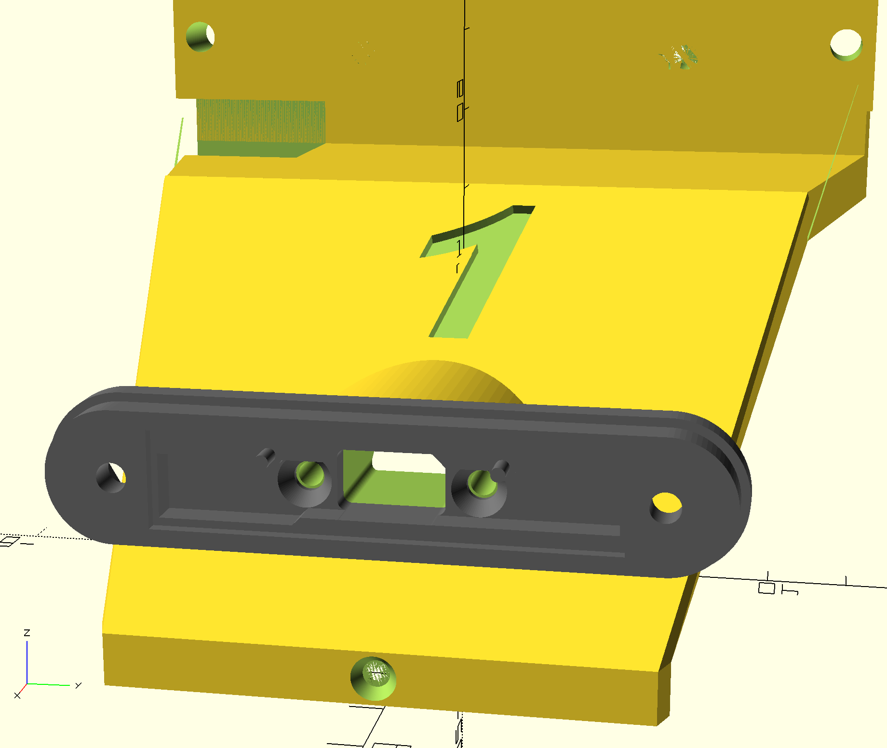

# mushr-lighting-system
System Design documentation and notes for a lighting system proposed for inclusion in the MuSHR project.

## Introduction
Modifications to the **mushr_cad** repository are proposed to accommodate mounting optional lighting hardware based on the Adafruit NeoPixel Stick (x8 RGBW LEDs) product. The lighting can be used for illumination in dark environments when using the RGB camera element of the Intel D435/D455 RealSense Depth Camera (for capturing images/video or for teleoperation). The lighting elements can optionally be used to give some visual feedback to the user about the state of various components of the robot at a glance without needing to SSH into the system or plug in the monitor and keyboard. For example one LED could indicate WiFi connection established, another indicating Bluetooth connection to controller established, and others indicating the status of the various ROS packages, etc.) or to provide other lighting effects.

This document provides the system design for such a lighting system and details some specific changes to the **mushr_cad** OpenSCAD design files in order to accommodate this system.

## Description of CAD Changes
The proposed changes provide the necessary design elements for adding optional *Headlight*, *Top Lightbar* (in place of the T265 Tracking Camera, if you are not using one) and *Rear Lightbar* assemblies (e.g. mounted to the rear bumper of the race car chassis). In addition to the lighting assemblies, I propose use of the Adafruit Trinket-M0 (a small, Arduino-compatible Microcontroller board) to drive the lighting assembly control signals through a simple wiring harness. Lastly, the Trinket-M0 will be plugged into an available USB connector on the NVIDIA Jetson Nano for power (+5V ≤ 500mA) and communications with a ROS package currently in development.

The following figure gives a high-level overview of the lighting system design:


The headlight assemblies make use of a separate GitHub repository that I created for use as an enclosure for the Adafruit NeoPixel Stick product. The repository is located at: [pfliegster/neopixel-enclosures](https://github.com/pfliegster/neopixel-enclosures). This repository's design elements could eventually be incorporated into the mushr_cad design hierarchy or simply treated separately and included (this is my current proposed solution, as described below).

Similarly, I have created another GitHub repository for the creation of an enclosure, as well as a standalone mounting base for the Adafruit Trinket-M0 product (the mounting base module is used for these proposed changes). This repository is located here: [pfliegster/trinket-m0-enclosure](https://github.com/pfliegster/trinket-m0-enclosure)

Both of these repositories have detailed **README.md** files describing construction of the respective design elements and use. These repositories are expected to be cloned or downloaded into the same directory structure and at the same directory level as mushr_cad in order to be referenced correctly from the modified design files I’m proposing, like so:
```
  repos_directory
     ├── mushr_cad
     ├── neopixel-enclosures
     ├── trinket-m0-enclosure
     ├── … other directories …
```
The specific changes to the mushr_cad OpenSCAD design are detailed in the following sections …

### 1 - Optional Headlight Assembly
Add an optional Headlight Assembly mounting structure (enabled by setting the boolean variable `_include_neopixel_headlight = true;`) to the top of the *RacecarFrontCoverCenter()* module in **racecar_front_cover_center.scad**. In order to accommodate this, I decided to move the *RacecarCoverNumber()*  object up slightly (in file **racecar_cover_number.scad**) so that it is visible when the headlight is added (this can be changed to a build option if desired, so that it is in the current location if no headlight assembly is implemented).

To complete the changes necessary for this first item, I’ve also updated the **racecar_all.scad** design file to add visibility for the headlight assembly when it is enabled. Additionally, I've modified the orientation of the *RacecarFrontCoverWhole()* model for printing (`_print_config = true`) in file **racecar_front_cover_whole.scad** - since the headlight mounting structure now protrudes from the top of the RFCW model, I've found good luck printing the model at a -90 degree rotation instead and using an adequate support structure in the 3D slicer software. Finally, rounding out the changes for this item, I've added two new STL files for the construction of the headlight assembly itself (**headlight_assembly_back.stl** and **headlight_assembly_front.stl**) and a third new STL file for the RFCW model with the lighting system changes (with headlight assembly and Trinket-M0 mounting base described in next section): **racecar_front_cover_whole_with_lighting_additions.stl**).

Generation of the **headlight_assembly_back.stl** and **headlight_assembly_front.stl** files can be handled directly within the **racecar_front_cover_center.scad** design file as alternate print configurations (uncomment desired model, while commenting out other models ... similar to how it appears that the T265 mounting plate is done now).

The following images show the optional headlight mount enabled (notice the access hole all the way through the surface of the Racecar Front Cover Center (RFCC) model section for the wiring harness coming out of the back of the headlight assembly):

 

In the left figure above, you may also notice a shallow line/groove cut across the breadth of the RFCC model section - this is intentional. It allows for just enough extra clearance for assembly of the headlight parts (shown below). This groove is not visible once the assembly is in place.

The following sequence of illustrations detail how the headlight assembly mounts onto the headlight mount structure while highlighting some of the design features.

Steps 1 & 2 - Align back NeoPixel Enclosure model part onto the racecar headlight mounting structure, Insert and screw in two M3x10mm flat-head screws to secure the part to the RFCC (these will self-tap into the structure of the racecar cover headlight mount):

 

Step 3 - Insert NeoPixel Stick PCB (with pre-soldered wire harness) into the headlight enclosure back part ... the wiring harness will fit through the access hole and be visible on the underside of the racecar front cover:

 

Steps 4 & 5 - Attach the front NeoPixel Enclosure model part such that it fits snugly around the lip from the back model part and the screw holes should be aligned, then screw in two additional M3x10mm flat-head screws while holding the M3 nuts in the nut pockets in the back of the headlight assembly to secure the front to the rest of the headlight assembly:

 

Here is a final view showing the M3 nuts securing the headlight assembly once it is completely assembled to the racecar front cover.


Other notes about Item #1:
* The Headlight Assembly’s back enclosure part is currently screwed into the headlight mounting structure (new optional part of RFCC) using two M3x10mm flat-head screws. I designed it such that it will self-tap into this structure. The mounting holes that I added to the headlight mount are slightly undersized in diameter to allow this (2.8mm diameter, as found in the **neopixel-enclosures** repository -> **neopixel_x8_stick_case_back.scad** -> *MountingScrewsCutoutRegion()*). This self-tapping strategy seems to work well with these dimensions in PLA and perhaps other materials as well.

I realize that the vast majority (if not all) of other mounting screw are not done this way in the **mushr_cad** design files and instead use nuts inserted into nut pockets, or the back-side is freely accessible for the placement of a nut on a flat surface. This structure is a little unique due to the sloped nature of the front cover part, so … if this is necessary for the MuSHR project standards, I could potentially make another modification to add M3 Nut inset/countersunk from the underside of the *hood* and make it deep enough to have a viable, flat surface to push against (and modify screw lengths as required to support this).

### 2 - Optional Trinket-M0 Mounting Base (used as lighting controller)
Add an optional mounting base structure for the Trinket-M0 PCB (to drive the lighting assemblies) to the underside of the *RacecarFrontCoverCenter()* module in **racecar_front_cover_center.scad** (also enabled by setting a boolean variable at the top of the file as follows: `_include_trinket_mcu = true;`).

Shown below are the mounting base structure added to the underside of the RFCC (left) and the Trinket-M0 Assembly, which includes the wiring and two M2x8mm self tapping screws (right):


To complete the changes necessary for this item, I’ve also updated the **racecar_all.scad** design file to add visibility for the Trinket-M0 assembly (including representative wiring harness and mounting screws) when it is enabled

Other notes about Item #2:
* Similar to Item #1 above, I used an approach for self-tapping the M2x8mm screws into the underside of the RFCC model section. I don’t readily see an easy way to add a hidden nut pocket, but perhaps inserting one as a countersunk hexagonal nut pocket from the top of the RFCC *shelf*/*camera cutout* would work … they may be partially visible on the top surface of the race car cover, but perhaps obscured once the D435/D455 camera is installed (at least with the T265 Plate also installed). Note - the M2 screw is the largest diameter supported by the mounting hole in the Trinket-M0 PCB (I can't go up to the M2.5 size which are used in other places in the MuSHR assembly). I would also need to ensure that I could get a suitable M2 long enough to make this work (there needs to be at least some minimum amount of space under the Trinket-M0 PCB for wiring).

### 3 - Optional Top Lightbar Assembly (in place of T265 when unused)

**NOTE: CHANGE #3 IS TBD, PENDING ACCEPTANCE OF CHANGES #1 & 2 FIRST**

An optional Top Lightbar Assembly is proposed for cases where there is not a T265 Tracking Camera present in the system. To support this change, I added a new design module *RacecarFrontCoverCenterLightBarPlate()* to **racecar_front_cover_center.scad** for implementing the *Top Lightbar* assembly. This lightbar assembly is built to similar dimensions and to fit in place of the current *RacecarFrontCoverCenterT265Plate()* module, but with the structure of the **neopixel-enclosures** back model part embedded in it to allow mounting the NeoPixel Stick PCB and route the wiring harness out through the back of the plate. However, it is designed in a similar way, allowing the installation of the D435/D455 camera on the same plate below the Lightbar assembly itself.


I had considered using a similar approach to that of the Headlight Assembly, whereby the Top Lightbar could be a separate assembly mounted to some additional screw holes added to the existing *RacecarFrontCoverCenterT265Plate()* module. However, I decided upon this embedded approach in order to minimize the profile and limit how much overhang is above the D435/D455 camera ventilation holes. This could be changed to a screw-on assembly approach instead if desired.
Similar to how the construction of the headlight assembly is enabled (Change #1 above), the Top Lightbar assembly is built by setting the boolean variable:
```openscad
_include_neopixel_lightbar  = true; 
```
The wiring for this assembly is then routed out of the back of the *RacecarFrontCoverCenterLightBarPlate()* part and through the same hole in the top cover as the wiring for the YDLIDAR module, as shown here:


The OpenSCAD model of the MuSHR Top and Front Cover Assembly (modified with my own graphics) is show below with the Headlight and Top Lightbar assemblies added, along with a D435i camera and the YDLIDAR up top:


And the completed robotic vehicle with all three lighting assemblies is shown below:


Other notes on Item #3:
* This modification was originally completed on the **mushr_cad** repository version prior to the addition of D455 camera mounting provisions, so I will have to make/test these new changes/dimensions with the current repository head revision.

### 4 - Optional Rear Lightbar Assembly
Note: Change #4 Does not require any changes to **mushr_cad** OpenSCAD design files. However, If the user would like to add this assembly to their build, the two model parts required to construct this assembly are added to the repository: **rear_lightbar_assembly_back.stl** and **rear_lightbar_assembly_front.stl**.

Generation of these STL files can be handled directly within the **racecar_front_cover_center.scad** design file as alternate print configurations (uncomment desired model, while commenting out other models ... similar to how it appears that the T265 mounting plate is done now).

This assembly is built similarly to the headlight assembly & requires the same 2x M3x10mm flat-head screws and 2x M3 nuts in order to hold the assembly together.

Currently, I simply zip-tie this lightbar to the race car’s rear bumper (or rest it on top of it, as shown in Fig. 16 below). However, a more permanent CAD structure could be created and added to mushr_cad in the future if this is a desired permanent fixture.


If the user does not require the *Headlight* or *Top Lightbar* assemblies described above (or is prevented from adding the top lightbar due to the addition of the T265) but still desires a light assembly for visual feedback or for ROS software development purpose, this *Rear Lightbar* assembly can be added to your system. Clever routing of the wiring harness (described in the next section) could also be done in such a way that the *Rear Lightbar* assembly can easily be unplugged and removed when not needed, but then plugged back in to provide some visual feedback when needed (Note: only plug/unplug neopixel lighting assemblies to/from the system when power to the robot is OFF).

## Lighting System Wiring Harness & Power Budget
In addition to the CAD changes detailed above, the proposed lighting system will require a simple wiring harness to pass power and digital control to the lighting assemblies. The proposed system is intended to be powered directly from the same USB port as is used for communication with the Jetson Nano. The USB Power (+5V VUSB) is available on the Trinket-M0 PCB and is used to power the 1-3 NeoPixel lighting assemblies. Pin 4 on the Trinket-M0 is the recommended Serial Data (SDA) output for digital control, as it supports DMA directly with the Adafruit Arduino library for NeoPixel products (*Adafruit_NeoPixel_ZeroDMA*). A spare pin (Pin 3) is also suggested for wiring to the Trinket Harness connector for future use, although it is currently terminated in the wiring harness (heat-shrink over tip).

Data is written to the NeoPixel Sticks from SDA on the Trinket-M0 to the DIN input on the first lighting assembly and you can daisy chain multiple NeoPixel sticks serially. Notice that each NeoPixel stick has a DOUT output which is then wired up to the DIN input of the next NeoPixel stick in the chain through the wiring harness. The DOUT signal from the last light assembly in the chain is again just terminated in the harness.


### Sidebar: The Power Budget
For practical purposes, I’ve found that up to 3 Assemblies (up to 24 LEDs) can readily run off of the USB power directly from the Jetson Nano Developer Kit USB connectors (along with the Trinket-M0 power consumption), with some consideration in the selection of lighting patterns and brightness values. Additionally, the MuSHR power system design, and more specifically the 5V delivered from the Developer Kit over USB, seems to have slow enough ramp-up time with little overshoot, so the 1000 µF extra capacitor recommended by Adafruit on the NeoPixel stick modules may not be necessary, saving a little extra complexity. I’ve left these off on my build without problem.

For the purposes of this budget, we're specifically interested in how much current is required on the +5V VUSB power rail (everything in the proposed lighting system is powered from this), and how much current we are able to count on from the system. The Jetson Nano Development Kit specifies up to 1A on each Stack (2x) of USB connectors, so the goal is to have a total Current of the lighting system ≤ 500mA. Each NeoPixel is actually comprised of four individual LED elements (for RGBW NeoPixel sticks) - one each for Red, Green, Blue, and White. Each of these elements can use up to 20mA at full brightness which can add up quickly of you set all LED elements of all NeoPixels to full brightness on 3 NeoPixel assemblies:

    24 (NeoPixels) x 4 (elements/pixel) x 20mA = 1.92 A 

This is **WAY** over our supply current budget of 500 mA, so the Trinket-M0 lighting control software should use colors, brightness, duty cycle, LED element combinations or patterns, etc. that are designed to limit the overall current on the VUSB power rail to be ≤ 500mA. A good guide on limiting/reducing power consumption of a NeoPixel-based lighting system is available here: https://learn.adafruit.com/sipping-power-with-neopixels

For completeness, a rough computation of the worst-case current required by the Trinket-M0:
PCB Part | Current (on +5V VUSB)
---------|----------------------------
ATSAMD21E18 MCU:                   | < 8 mA
APA102-2020 RGB DotStar LED:       | < 60 mA
2x 0603 LED (Green/PWR + Red/User):| < 2 mA
Total Current (worst-case):        | **70 mA**

However, by limiting use of the on-board DotStar (it won’t be visible when embedded in MuSHR assembly but may be useful for Trinket software development purposes), it should be easily possibly to limit the total Trinket-M0 PCB current itself to ≤ 20mA with typical use.

With the above notes in mind, the 500 mA budget should be readily achievable for a wide variety of patterns and use cases envisioned, but the maximum current utilized could also be guaranteed via software control if required.

If your use case anticipates needing more than 500 mA based on the number of NeoPixels, desired colors, patterns and brightness for your setup, you should consider the alternate wiring approach shown below which uses a separate  +5V supply with adequate margin. Also, depending upon the specifications for this +5V source, you may consider adding the recommended 1000 µF capacitors back into the mix as well to ensure that the NeoPixels are not damaged (Note: the current **neopixel-enclosures** GitHub repository design does not account for the extra space required for this capacitor … but could be added in a future revision of this design).


Alternatively, if you only require 1 or 2 Lighting assemblies in your system (8 or 16 NeoPixels total), the ≤ 500mA current limit becomes much easier to meet. 

### Wiring for Single Lighting Assembly
A single NeoPixel lighting assembly system would be virtually assured of meeting the 500 mA current budget. Such a system also greatly simplifies the wiring harness, as shown here:


Continued use of the same 4-pin modular wiring system (shown above) would allow for easy upgrade to multiple lighting assemblies in the future without requiring re-soldering wire harnesses onto the Trinket-M0 and NeoPixel Stick PCBs. CAUTION: the DOUT signal should be terminated in this case in order to ensure that the signal is not routed back to the Trinket-M0 GPIO (The Trinket-M0 MCU is running at +3.3V, while the NeoPixel is running at +5V so this could potentially cause damage). However, it is acceptable to drive the NeoPixel DIN input with the Trinket-M0 3.3V output (SDA) directly.

If you are certain that the single lighting assembly is adequate for your setup, the lighting system can be simplified even further by eliminating the intermediate wiring harness connections and using 3-pin connectors on both the Trinket-M0 and NeoPixel Stick assemblies instead, as illustrated here:


## Trinket-M0 Software
The Trinket-M0 software is a work in process (WIP), developed as a sketch in the Arduino IDE. The beta version of the software uses the [NeoPatterns library](https://github.com/ArminJo/NeoPatterns), available for inclusion directly in the Arduino IDE, for communication of desired lighting patterns, colors, and brightness values to the NeoPixel LED array segment(s).

The Trinket-M0 software responds to lighting control and status request commands from the ROS package, which are communicated using the Virtual COM Port (VCP) through the USB interface.

GitHub repository: [pfliegster/mushr-lighting-control](https://github.com/pfliegster/mushr-lighting-control)

See the repository for example source code, documentation and VCP command definition/options.

## ROS Package software
In order to communicate with the Trinket-M0 over the USB connection (using the Virtual COM Port), I’ve started the development of a package called: **mushr_lighting**, GitHub repository: TBD

The ROS package is responsible for sending commands to the Trinket-M0 to change the lighting patterns or colors. The package performs some monitoring of system status (Wi-Fi, Bluetooth, etc.) and can also be used to subscribe to other ROS node topics to aid in the development process of other ROS packages or to respond to different joystick events while under teleoperation (e.g. change light pattern/color based on button press). Lot's of possible use cases here ...

## License
All design files are provided under the terms of the Creative Commons *Attribution-NonCommercial-ShareAlike 4.0* license. Please see accompanying license.txt file for details.
